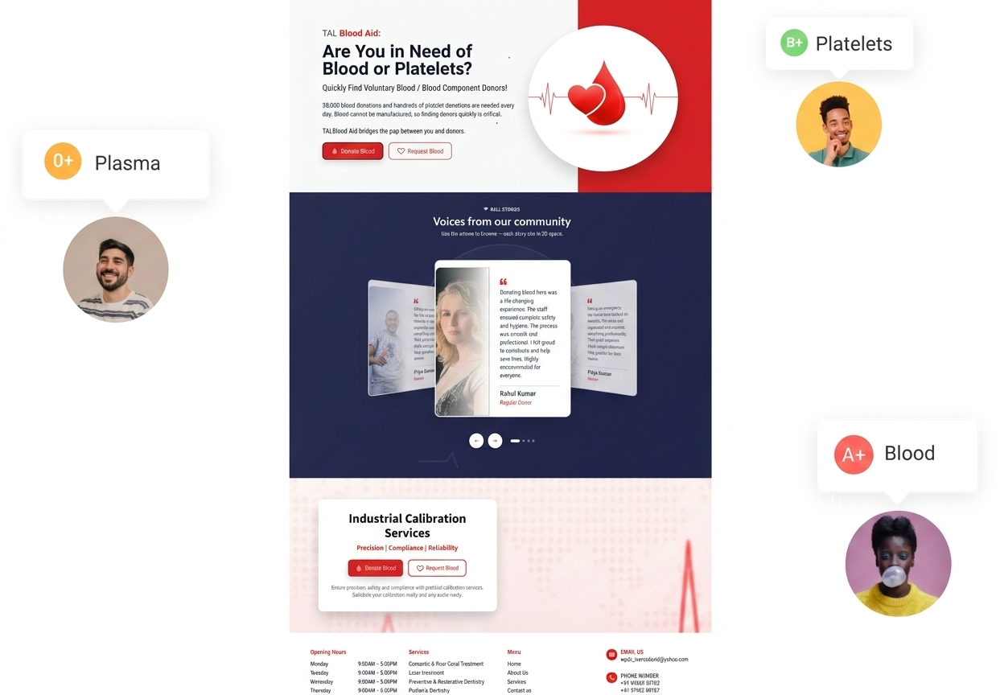

# RedStream — Blood Bank Management System

> A full-stack healthcare web app that connects blood donors, patients, and hospital staff — with role-based dashboards, patient management, and a modern landing experience.

[](https://redstream-enitha-s-projects.vercel.app)
[](https://react.dev/)
[](https://vitejs.dev/)

**Live demo:** [redstream-enitha-s-projects.vercel.app](https://redstream-enitha-s-projects.vercel.app)

**Author:** [Enitha Chandrasekaran](https://github.com/Enithachandrasekaran) · [Portfolio](https://enithachandrasekaran.github.io/enitha-portfolio/) · [LinkedIn](https://www.linkedin.com/in/enitha-c-2174a6230)

---

## Overview

**RedStream** is a Blood Bank Management System built with React and Node.js. It provides a public-facing landing page for blood donation awareness, secure authentication, and protected dashboards for different user roles (admin, doctor, patient, user).

Recruiters and reviewers can explore the **live UI on Vercel** in under 30 seconds. Full login and patient CRUD require a local or hosted MongoDB backend.

---

## Features

| Area | What it does |
|------|----------------|
| **Landing page** | Hero, features, testimonials, call-to-action, and responsive navigation |
| **Authentication** | Register and login with Formik + Yup validation |
| **Role-based access** | Separate routes for admin, doctor, patient, and user |
| **Patient management** | View, add, edit, and delete patient records |
| **Dashboard** | Role-aware stats and navigation sidebar |
| **REST API** | Express server with MongoDB (Mongoose) |
| **UX** | Skeleton loaders, toast notifications, responsive Tailwind UI |

---

## Screenshots

### Landing page


### Hero section


### Login


---

## Tech Stack

**Frontend**
- React 19 · Vite 7 · React Router 7
- Tailwind CSS · Formik · Yup
- GSAP · Swiper · Lucide React · React Toastify

**Backend**
- Node.js · Express 5
- MongoDB · Mongoose
- Multer (file uploads) · CORS · dotenv

**Deployment**
- Vercel (frontend) · GitHub

---

## Installation

### Prerequisites
- Node.js 18+
- MongoDB (local or [MongoDB Atlas](https://www.mongodb.com/atlas))

### 1. Clone the repository

```bash
git clone https://github.com/Enithachandrasekaran/smart-ui-app.git
cd smart-ui-app
```

### 2. Install dependencies

```bash
npm install
```

### 3. Environment variables

Copy the example file and update values:

```bash
cp .env.example .env
```

```env
MONGO_URI=mongodb://127.0.0.1:27017/studentDB
PORT=5001
VITE_API_URL=http://localhost:5001
```

### 4. Run locally

```bash
npm start
```

| Service | URL |
|---------|-----|
| Frontend (Vite) | http://localhost:5173 |
| Backend (API) | http://localhost:5001 |

**Other scripts**

```bash
npm run dev      # Frontend only
npm run server   # Backend only
npm run build    # Production build
```

---

## Project structure

```
smart-ui-app/
├── server.js              # Express API entry
├── src/
│   ├── main.jsx           # Routes & app shell
│   ├── context/           # Auth context
│   ├── components/        # Dashboard, login, patients, etc.
│   └── pages/landingpage/ # Public landing UI
├── .env.example
└── vercel.json            # SPA routing for Vercel
```

---

## API endpoints (backend)

| Method | Endpoint | Description |
|--------|----------|-------------|
| `POST` | `/register` | Create user account |
| `POST` | `/login` | Authenticate user |
| `GET` | `/api/users` | List users/patients |
| `PUT` | `/api/users/:id` | Update user |
| `DELETE` | `/api/users/:id` | Delete user |

---

## Deployment

**Frontend (Vercel)** — already deployed. Set `VITE_API_URL` in Vercel environment variables when the backend is hosted.

**Backend** — deploy `server.js` to Render, Railway, or similar and point `VITE_API_URL` to that URL.

---

## Repository links

- **GitHub:** [github.com/Enithachandrasekaran/smart-ui-app](https://github.com/Enithachandrasekaran/smart-ui-app)
- **Live demo:** [redstream-enitha-s-projects.vercel.app](https://redstream-enitha-s-projects.vercel.app)
- **Profile:** [github.com/Enithachandrasekaran](https://github.com/Enithachandrasekaran)

---

## License

ISC
